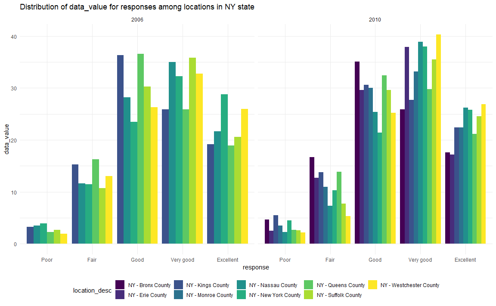

p8105\_hw3\_yq2279
================
Qi Yuchen
2019/10/10

# Problem 1

### A short description of the dataset

``` r
library(p8105.datasets)
data("instacart")

# Display the structure of the data
str(instacart)
```

    ## Classes 'tbl_df', 'tbl' and 'data.frame':    1384617 obs. of  15 variables:
    ##  $ order_id              : int  1 1 1 1 1 1 1 1 36 36 ...
    ##  $ product_id            : int  49302 11109 10246 49683 43633 13176 47209 22035 39612 19660 ...
    ##  $ add_to_cart_order     : int  1 2 3 4 5 6 7 8 1 2 ...
    ##  $ reordered             : int  1 1 0 0 1 0 0 1 0 1 ...
    ##  $ user_id               : int  112108 112108 112108 112108 112108 112108 112108 112108 79431 79431 ...
    ##  $ eval_set              : chr  "train" "train" "train" "train" ...
    ##  $ order_number          : int  4 4 4 4 4 4 4 4 23 23 ...
    ##  $ order_dow             : int  4 4 4 4 4 4 4 4 6 6 ...
    ##  $ order_hour_of_day     : int  10 10 10 10 10 10 10 10 18 18 ...
    ##  $ days_since_prior_order: int  9 9 9 9 9 9 9 9 30 30 ...
    ##  $ product_name          : chr  "Bulgarian Yogurt" "Organic 4% Milk Fat Whole Milk Cottage Cheese" "Organic Celery Hearts" "Cucumber Kirby" ...
    ##  $ aisle_id              : int  120 108 83 83 95 24 24 21 2 115 ...
    ##  $ department_id         : int  16 16 4 4 15 4 4 16 16 7 ...
    ##  $ aisle                 : chr  "yogurt" "other creams cheeses" "fresh vegetables" "fresh vegetables" ...
    ##  $ department            : chr  "dairy eggs" "dairy eggs" "produce" "produce" ...
    ##  - attr(*, "spec")=
    ##   .. cols(
    ##   ..   order_id = col_integer(),
    ##   ..   product_id = col_integer(),
    ##   ..   add_to_cart_order = col_integer(),
    ##   ..   reordered = col_integer(),
    ##   ..   user_id = col_integer(),
    ##   ..   eval_set = col_character(),
    ##   ..   order_number = col_integer(),
    ##   ..   order_dow = col_integer(),
    ##   ..   order_hour_of_day = col_integer(),
    ##   ..   days_since_prior_order = col_integer(),
    ##   ..   product_name = col_character(),
    ##   ..   aisle_id = col_integer(),
    ##   ..   department_id = col_integer(),
    ##   ..   aisle = col_character(),
    ##   ..   department = col_character()
    ##   .. )

The size of the dataset is 1384617 observations and 15 variables.  
The data structures in this dataset are integer and character.  
The key variables include “reordered” which indicates if this prodcut
has been ordered by this user before, “aisle” which is the name of the
aisle, “department” which is the name of the department, and
“product\_name” which is the name of the product.  
To illustrate the observations, take the first observation as an
example. The user with user\_id 112108 buys the product Bulgarian Yogurt
which has been bought by this costumer before indicated by the variable
reordered. This product belong to the yogurt aisle in the dairy eggs
department. Put the first to eighth observations together, they form one
order from user 112108, which is this user’s fourth order and placed at
10 at the day. It has been 9 days since the last order.

### Number of aisles and which aisles the most items are ordered from

``` r
# number of aisles
summarise(instacart, n_aisles = n_distinct(aisle_id)) %>% 
  knitr::kable()
```

| n\_aisles |
| --------: |
|       134 |

``` r
# aisles that the most items are ordered from 
instacart %>% 
  group_by(aisle) %>% 
  summarize(n_obs_aisle = n()) %>% 
  filter(min_rank(desc(n_obs_aisle)) < 4) %>% # here we show the top 3
  arrange(desc(n_obs_aisle)) %>% 
  knitr::kable()
```

| aisle                      | n\_obs\_aisle |
| :------------------------- | ------------: |
| fresh vegetables           |        150609 |
| fresh fruits               |        150473 |
| packaged vegetables fruits |         78493 |

There are 134 aisles, and the aisle that the most items are ordered from
is fresh vegetables, followed by fresh fruits and packaged vegetables
fruits.

### A plot that shows the number of items ordered in each aisle with more than 10000 items ordered

``` r
instacart %>% 
  group_by(aisle) %>% 
  summarize(n_obs_aisle = n()) %>% 
  filter(n_obs_aisle > 10000) %>% 
  mutate(aisle = forcats::fct_reorder(aisle, n_obs_aisle)) %>% 
  ggplot(aes(x = aisle, y = n_obs_aisle, fill = aisle)) + 
  geom_bar(stat = "identity") +
  labs(
    title = "Number of items in each aisle",
    x = "aisle",
    y = "number of items"
  ) +
  coord_flip()
```


### A table showing the three most popular items in each of the aisles “baking ingredients”, “dog food care”, and “packaged vegetables fruits”

``` r
instacart %>%
  filter(aisle == "baking ingredients" | aisle == "dog food care" | aisle == "packaged vegetables fruits") %>% 
  group_by(aisle, product_name) %>% 
  summarize(n_product = n()) %>% 
  filter(min_rank(desc(n_product)) < 4) %>% 
  arrange(aisle, desc(n_product)) %>% 
  knitr::kable()
```

| aisle                      | product\_name                                 | n\_product |
| :------------------------- | :-------------------------------------------- | ---------: |
| baking ingredients         | Light Brown Sugar                             |        499 |
| baking ingredients         | Pure Baking Soda                              |        387 |
| baking ingredients         | Cane Sugar                                    |        336 |
| dog food care              | Snack Sticks Chicken & Rice Recipe Dog Treats |         30 |
| dog food care              | Organix Chicken & Brown Rice Recipe           |         28 |
| dog food care              | Small Dog Biscuits                            |         26 |
| packaged vegetables fruits | Organic Baby Spinach                          |       9784 |
| packaged vegetables fruits | Organic Raspberries                           |       5546 |
| packaged vegetables fruits | Organic Blueberries                           |       4966 |

### A table showing the mean hour of the day at which Pink Lady Apples and Coffee Ice Cream are ordered

``` r
instacart %>%
  filter(product_name == "Pink Lady Apples" | product_name == "Coffee Ice Cream") %>% 
  group_by(product_name, order_dow) %>% 
  summarize(mean_hour = mean(order_hour_of_day)) %>% 
  pivot_wider(
    names_from = order_dow,
    values_from = mean_hour
  ) %>% 
  rename(Sunday = "0", Monday = "1", Tuesday = "2", Wednesday = "3", Thursday = "4", Friday = "5", Saturday = "6") %>% 
  knitr::kable(digits = 1)
```

| product\_name    | Sunday | Monday | Tuesday | Wednesday | Thursday | Friday | Saturday |
| :--------------- | -----: | -----: | ------: | --------: | -------: | -----: | -------: |
| Coffee Ice Cream |   13.8 |   14.3 |    15.4 |      15.3 |     15.2 |   12.3 |     13.8 |
| Pink Lady Apples |   13.4 |   11.4 |    11.7 |      14.2 |     11.6 |   12.8 |     11.9 |

# Problem 2

### Do some data cleaning

``` r
data("BRFSS")

df_BRFSS = brfss_smart2010 %>% 
  janitor::clean_names() %>% 
  rename(location_abbr = locationabbr, location_desc = locationdesc) %>% 
  filter(topic == "Overall Health") %>% 
  filter(
    response == "Excellent" | 
    response == "Very good" | 
    response == "Good" | 
    response == "Fair" | 
    response == "Poor") %>%
  mutate(response = forcats::fct_relevel(response, c("Poor", "Fair", "Good", "Very good", "Excellent")))
```

### States observed at 7 or more locations in 2002 and 2010

``` r
# 2002
df_2002 = df_BRFSS %>% 
  filter(year == 2002) %>% 
  group_by(location_abbr) %>% 
  summarise(n_locations = n_distinct(location_desc)) %>% 
  filter(n_locations > 6) 
pull(df_2002, location_abbr)
```

    ## [1] "CT" "FL" "MA" "NC" "NJ" "PA"

``` r
# 2010
df_2010 = df_BRFSS %>% 
  filter(year == 2010) %>% 
  group_by(location_abbr) %>% 
  summarise(n_locations = n_distinct(location_desc)) %>% 
  filter(n_locations > 6) 
pull(df_2010, location_abbr)
```

    ##  [1] "CA" "CO" "FL" "MA" "MD" "NC" "NE" "NJ" "NY" "OH" "PA" "SC" "TX" "WA"

In 2002, CT, FL, MA, NC, NJ, PA were observed at 7 or more locations. In
2010, CA, CO, FL, MA, MD, NC, NE, NJ, NY, OH, PA, SC, TX, WA were
observed at 7 or more locations.

### Construct a dataset and make a “spaghetti” plot

``` r
# limited to Excellent responses, and contains year, state, and a variable that averages the data_value across locations within a state
df_data_mean = df_BRFSS %>% 
  filter(response == "Excellent") %>% 
  rename(state = location_abbr) %>% 
  group_by(state, year) %>% 
  summarize(data_value_mean = mean(data_value, na.rm = TRUE))

# a “spaghetti” plot of this average value over time within a state
df_data_mean %>% 
  ggplot(aes(x = year, y = data_value_mean, color = state)) +
  geom_line() + geom_point() +
  labs(
    title = "Average data value over time within a state",
    y = "average data value"
  ) 
```


### Make a two-panel plot showing distribution of data\_value for responses

``` r
# for the years 2006, and 2010, among locations in NY State
df_BRFSS %>% 
  filter((year == 2006 | year == 2010) & 
         location_abbr == "NY") %>% 
  ggplot(aes(x = response, y = data_value)) + 
  geom_bar(aes(fill = location_desc), stat = "identity", position = "dodge") + 
  labs(title = "Distribution of data_value for responses among locations in NY State") +
  facet_grid(~year)
```



# Problem 3

### Load, tidy, and otherwise wrangle the data

``` r
df_accel = read_csv("./data/accel_data.csv") %>% 
  janitor::clean_names() %>% 
  mutate(weekday_or_weekend = case_when(
    day %in% c("Friday", "Monday", "Thursday", "Tuesday", "Wednesday") ~ "weekday",
    day %in% c("Saturday", "Sunday") ~ "weekend",
    TRUE ~ ""
  )) %>% 
  select(week, day_id, day,weekday_or_weekend, everything()) %>% 
  mutate(
    day = as.factor(day), 
    week = as.factor(week), 
    weekday_or_weekend = as.factor(weekday_or_weekend)
    ) %>% 
  mutate(day = forcats::fct_relevel(day, c("Monday", "Tuesday", "Wednesday", "Thursday", "Friday", "Saturday", "Sunday"))) %>% 
  pivot_longer(
    activity_1:activity_1440, 
    names_to = "minite", 
    names_prefix = "activity_", 
    values_to = "minite_counts"
    ) %>% 
  mutate(minite = as.numeric(minite))
```

    ## Parsed with column specification:
    ## cols(
    ##   .default = col_double(),
    ##   day = col_character()
    ## )

    ## See spec(...) for full column specifications.

The variables in this dataset are week, day\_id, day,
weekday\_or\_weekend, minite, minite\_counts, and there are 50400
observations. The dataset covers 5 weeks which is 35 days.

### Create a total activity variable for each day, and create a table showing these totals

``` r
n_activity_day = df_accel %>% 
  group_by(week, day) %>% 
  summarize(day_counts = sum(minite_counts)) 

pivot_wider(
  n_activity_day,
  names_from = day,
  values_from = day_counts
  ) %>% 
  knitr::kable(digits = 0)
```

| week | Monday | Tuesday | Wednesday | Thursday | Friday | Saturday | Sunday |
| :--- | -----: | ------: | --------: | -------: | -----: | -------: | -----: |
| 1    |  78828 |  307094 |    340115 |   355924 | 480543 |   376254 | 631105 |
| 2    | 295431 |  423245 |    440962 |   474048 | 568839 |   607175 | 422018 |
| 3    | 685910 |  381507 |    468869 |   371230 | 467420 |   382928 | 467052 |
| 4    | 409450 |  319568 |    434460 |   340291 | 154049 |     1440 | 260617 |
| 5    | 389080 |  367824 |    445366 |   549658 | 620860 |     1440 | 138421 |

``` r
n_activity_day %>% 
  ggplot(aes(x = day, y = day_counts, color = week, group = week)) +
  geom_point() +
  geom_line() +
  labs(
    title = "Total activity over the day", 
    y = "counts"
    )
```


On Tuesday and Wednsday, activity of different weeks are more stable
compared to other days.

### Make a single-panel plot that shows the 24-hour activity time courses for each day

``` r
#  use color to indicate day of the week
df_accel %>% 
  ggplot(aes(x = minite, y = minite_counts, color = day, group = day)) +
  geom_line(alpha = 0.5) +
  geom_smooth(se = FALSE) +
  scale_x_continuous(breaks = seq(0, 1400, by = 100), limits = c(0, 1450), labels = seq(0, 1400, by = 100)) +
  labs(
    x = "minute",
    y = "activity counts",
    title = "24-hour activity time courses"
  )
```

    ## `geom_smooth()` using method = 'gam' and formula 'y ~ s(x, bs = "cs")'


Activity counts are peak when it is around 11 am and 9 pm of the day
most days.
